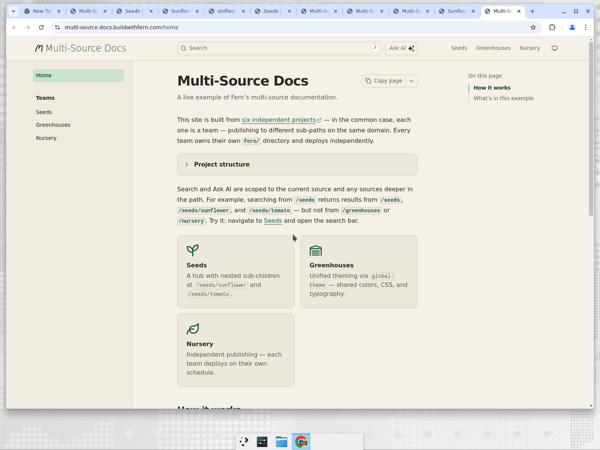
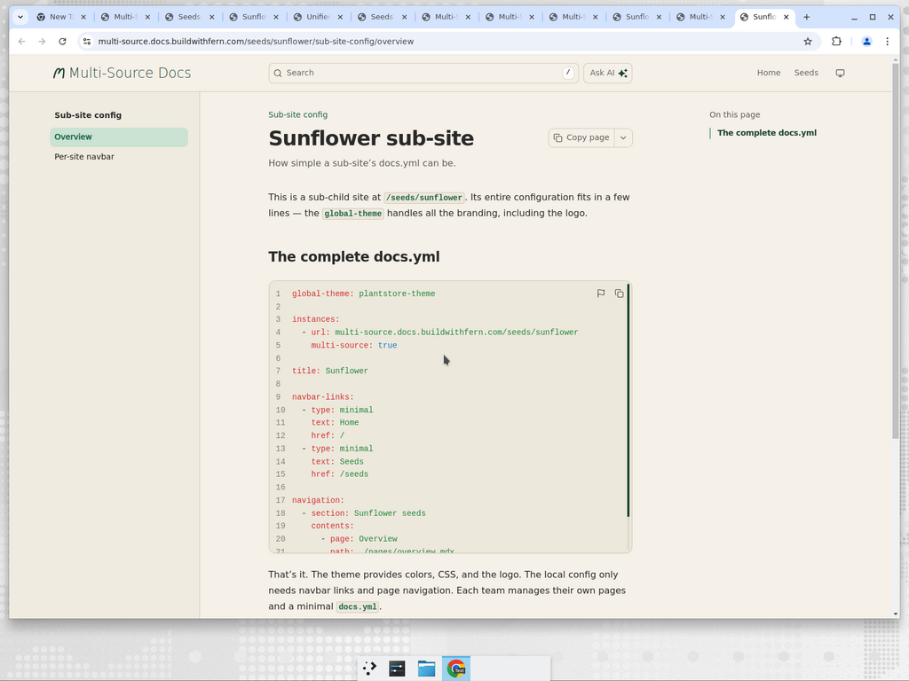

# Multi-Source Docs

A working example of [Fern's multi-source documentation](https://buildwithfern.com/learn/docs/getting-started/multi-source-docs) — six independent projects publishing to one domain, each with its own `fern/` directory and deploy lifecycle.

**Live site:** [multi-source.docs.buildwithfern.com](https://multi-source.docs.buildwithfern.com)



## Project structure

```
multi-source/
├── homepage/          → /                     (root landing page + theme source)
├── seeds/             → /seeds                (team hub with nested children)
├── seeds-sunflower/   → /seeds/sunflower      (sub-team site)
├── seeds-tomato/      → /seeds/tomato         (sub-team site)
├── greenhouses/       → /greenhouses          (standalone team site)
└── nursery/           → /nursery              (standalone team site)
```

Each folder contains a `fern/` directory with its own `docs.yml`, `fern.config.json`, and pages.

## Global theme

All six sites share a `global-theme` called `plantstore-theme`. It's defined once in the homepage project and uploaded to Fern's registry, so every sub-site gets consistent branding with zero duplication.

### What the theme provides

- **Colors** — light tan background, dark forest green accents, with dark mode variants
- **CSS** — card hover effects, sidebar typography, heading letter-spacing
- **Logo** — shared leaf icon with "Multi-Source Docs" text

### theme.yml

```yaml
colors:
  accent-primary:
    dark: '#70E155'
    light: '#1B4332'
  background:
    dark: '#1A1A17'
    light: '#F5F0E8'
  border:
    dark: '#3A3A30'
    light: '#D4C9B5'
  sidebar-background:
    dark: '#1F1F1B'
    light: '#F0EBE1'
  header-background:
    dark: '#1A1A17'
    light: '#F5F0E8'
  card-background:
    dark: '#252520'
    light: '#EDE8DC'
css: ./assets/styles.css
logo:
  href: /
  dark: ./assets/logo-dark.svg
  light: ./assets/logo-light.svg
  height: 28
  right-text: Multi-Source Docs
```

### Uploading the theme

```bash
# Export theme-eligible fields from docs.yml into a theme/ directory
fern docs theme export

# Upload to the registry under a name your org can reference
fern docs theme upload --name plantstore-theme
```

Every other site references it with a single line in their `docs.yml`:

```yaml
global-theme: plantstore-theme
```

## Sub-site docs.yml

Each sub-site's configuration is minimal — the theme handles branding, so teams only define their instance URL, navbar links, and page navigation.



Here's the complete `docs.yml` for the Sunflower sub-site:

```yaml
global-theme: plantstore-theme

instances:
  - url: multi-source.docs.buildwithfern.com/seeds/sunflower
    multi-source: true

title: Sunflower

navbar-links:
  - type: minimal
    text: Home
    href: /
  - type: minimal
    text: Seeds
    href: /seeds

navigation:
  - section: Sub-site config
    contents:
      - page: Overview
        path: ./pages/overview.mdx
      - page: Per-site navbar
        path: ./pages/planting.mdx
```

The key setting is `multi-source: true` on the instance — this tells Fern to publish to a sub-path without overwriting other sites on the same domain.

## Publishing

Each site publishes independently:

```bash
cd multi-source/seeds-sunflower
FERN_TOKEN=$FERN_TOKEN fern generate --docs
```

Sites can be published in any order, at any time, without affecting each other.

## Features demonstrated

| Feature | Where to see it |
| --- | --- |
| Multi-source publishing | Every sub-path is a separate project |
| Nested sub-children | `/seeds` → `/seeds/sunflower`, `/seeds/tomato` |
| Global theme | Shared colors, CSS, and logo via `plantstore-theme` |
| Per-site navbar | Each site defines its own header links |
| Hierarchical search | Search from `/seeds` includes child paths |
| Independent deploys | Teams publish without coordinating |
